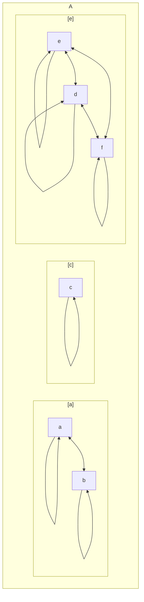

# Definición
---
Una relación de equivalencia es una [[Relación|relación]] que cumple simultáneamente las propiedades
* Reflexiva
* Simétrica
* [[Transitividad en relaciones de orden|Transitiva]]

Podemos ver que al introducir una relación de equivalencia en un conjunto, formaremos pequeños clústeres aislados en el conjunto, de modo que cualquier elemento de un clúster está en relación todos los elementos del mismo clúster, y con ningún elemento fuera del clúster

Donde cada clúster es una [[Clase|clase]], la cual normalmente se elige un representante de cada clase

La relación de equivalencia introduce una partición de clases, coloquialmente conocida como [[Partición|partición]]. Todos los elementos están en por lo menos una clase y las clases son disjuntas

Se entiende $A/R$ como el conjunto de clases de $A$ bajo la relación de equivalencia $R$ $$ A/R = \Set{ [a] : ~ a \in A } $$