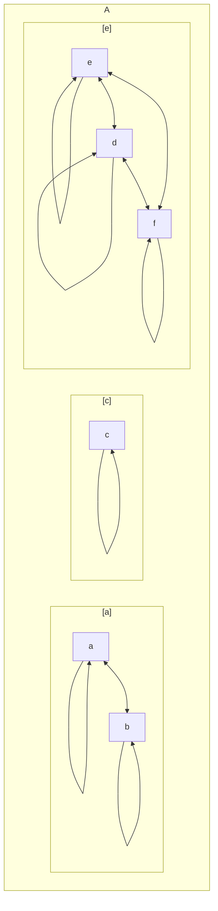

```dataviewjs
	await dv.view("_scripts/dataview/notas/etapa", { etapa: dv.current()?.etapa });
```
# Definición
---
Una relación de equivalencia es una [[Relación|relación]] que cumple simultáneamente las propiedades
* [[Relación reflexiva|Reflexiva]]
* [[Relación simétrica|Simétrica]]
* [[Relación transitiva|Transitiva]]





# Referencias
---
```dataviewjs
	await dv.view("_scripts/dataview/referencia/referenciasArchivo", { archivo: dv.current() });
```